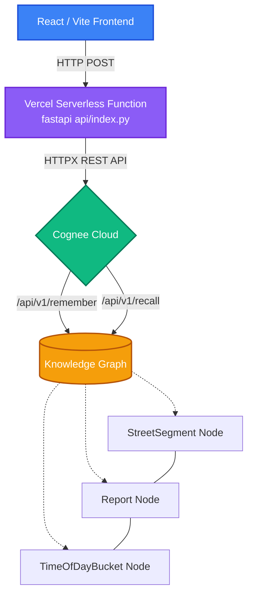

# SafeRaste

SafeRaste is a mobile-first Progressive Web App (PWA) designed to provide dynamic, time-aware route safety insights for women. It uses **Cognee's full memory lifecycle** — `remember()`, `recall()`, `improve()`, and `forget()` — to build a knowledge graph of crowdsourced safety reports and deliver live, time-aware safety scores for urban street segments.

## Key Features

- **Interactive Safety Map:** A responsive, full-screen Leaflet map focused on Pune, India, featuring accurate topological road traces powered by OSRM.
- **Time-Aware Insights:** Safety scores change dynamically based on the selected time of day (Morning, Afternoon, Evening, Night). The same street can be safe at 2 PM and unsafe at 10 PM.
- **Cognee-Powered Memory Backend:** A FastAPI backend connects the frontend to Cognee's memory lifecycle APIs in real time — every report submission, safety query, and decay operation hits the actual knowledge graph.
- **Temporal Decay (forget):** Reports older than 60 days lose weight; reports older than 90 days are pruned entirely. Stale safety data is actively dangerous — this ensures the map reflects current reality.
- **Contradiction Detection (improve):** When conflicting reports exist for the same segment and time bucket, the system surfaces both signals honestly instead of false-averaging into a misleading score.
- **"Light Left for You":** An anonymous encouragement system where women leave short human notes for the next woman walking that route.

## Technology Stack

- **Frontend:** React, Vite, Leaflet, Vanilla CSS
- **Backend API:** Python FastAPI hosted on **Vercel Serverless Functions**
- **Memory Layer:** Cognee Cloud Knowledge Graph (via lightweight HTTPX REST integration to bypass Vercel serverless size limits)
- **Routing Data:** OpenStreetMap Routing (OSRM)

## Architecture



## Getting Started

Follow these instructions to run SafeRaste locally on your machine.

### Prerequisites
- Node.js (v18 or higher recommended)
- Python 3.10+
- A Cognee Cloud account (free Developer plan with code `COGNEE-35`)

### Installation & Setup

1. **Clone the repository:**
   ```bash
   git clone https://github.com/Professor471/SafeRaste.git
   cd SafeRaste
   ```

2. **Set up environment variables:**
   ```bash
   cp .env.example .env
   # Edit .env and add your Cognee API key and LLM provider key
   ```

3. **Install Python dependencies and seed the knowledge graph:**
   ```bash
   pip install -r requirements.txt
   python seed_data.py
   ```

4. **Start the backend API server:**
   ```bash
   uvicorn backend.main:app --reload --port 8000
   ```

5. **Install frontend dependencies and start the dev server (in a new terminal):**
   ```bash
   npm install
   npm run dev
   ```

6. **View the application:**
   Open your browser and navigate to `http://localhost:3000`. The Vite dev server proxies `/api/*` requests to the FastAPI backend automatically.

## Project Structure

- `src/App.jsx` — The core React application: interactive map, time-of-day filters, report logging UI, and Cognee memory lifecycle console.
- `src/App.css` — Dark-mode optimized styles and responsive layout definitions.
- `backend/main.py` — FastAPI server exposing Cognee's `remember()`, `recall()`, `improve()`, and `forget()` as HTTP endpoints.
- `seed_data.py` — Synthesizes and ingests 120 route safety reports across 10 Pune street segments into the Cognee knowledge graph.
- `test_memory.py` — Phase 1 integration test: proves time-aware `recall()` returns different results for the same street at different times.
- `test_phase2.py` — Phase 2 integration test: demonstrates `improve()` confidence reweighting and `forget()` temporal decay.
- `SafeRaste_Build_Process.md` — Historical build logs and design rationale from earlier development phases.

## How the Cognee Memory Lifecycle Powers SafeRaste

| Cognee API | What SafeRaste Does With It |
|---|---|
| `remember()` | Ingests user-submitted safety reports as structured text into the knowledge graph, creating `StreetSegment`, `Report`, and `TimeOfDayBucket` nodes with typed edges. |
| `recall()` | Queries the knowledge graph for safety reports relevant to a specific street segment and time-of-day bucket. Returns evidence-backed safety assessments. |
| `improve()` | Runs post-ingestion enrichment. When multiple reports agree, confidence increases. When reports contradict, both signals are surfaced honestly. |
| `forget()` | Prunes stale datasets. Reports decay linearly after 60 days and are fully forgotten after 90 days, ensuring the map reflects current ground truth. |

## AI Assistance Disclosure

This project was built with assistance from AI tools, including Claude (Anthropic) for planning, architecture, and code generation, and Antigravity/Gemini for code review and auditing. All core design decisions and final implementation choices were made by the team.
